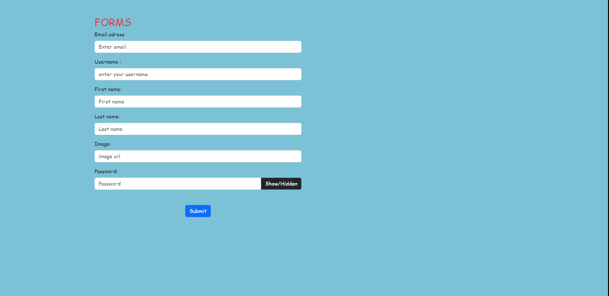

## Escaped Button 💨🙂
## Description
I created this project to learn how to use form elements with React.  
Validation =>  
✔ Filling in all fields, 
✔ The email must be valid => contain @, have 2 or 3 digits after the @ sign, 
✔ İmage must be a url. 

* If the user navigates to the button without providing validation, preventing the user from clicking the button
* When the form is submitted, the information is displayed as a card structure at the bottom and the inputs in the form are emptied.
* Setting whether to display the password when the Show/Hidden button is clicked.

## Project Live Link
[Click](https://form-react-zlh.vercel.app/)

## How does my project look

## Technologies
* React
* React form
* React-Bootstrap
  
